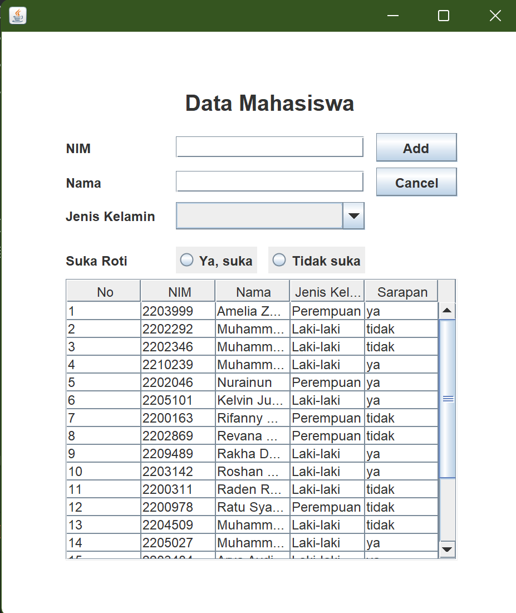
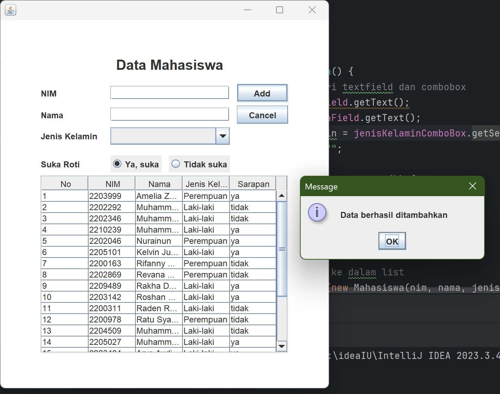
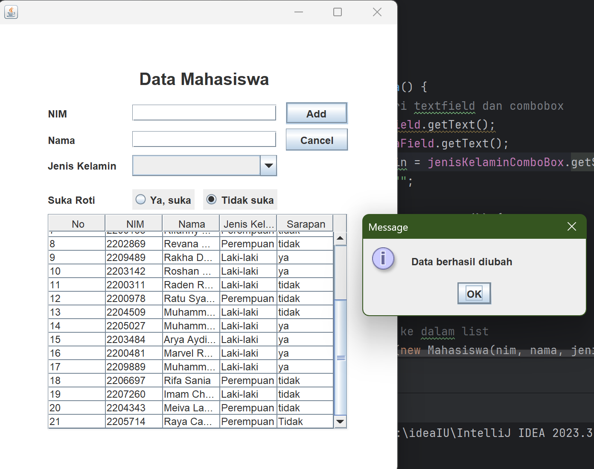
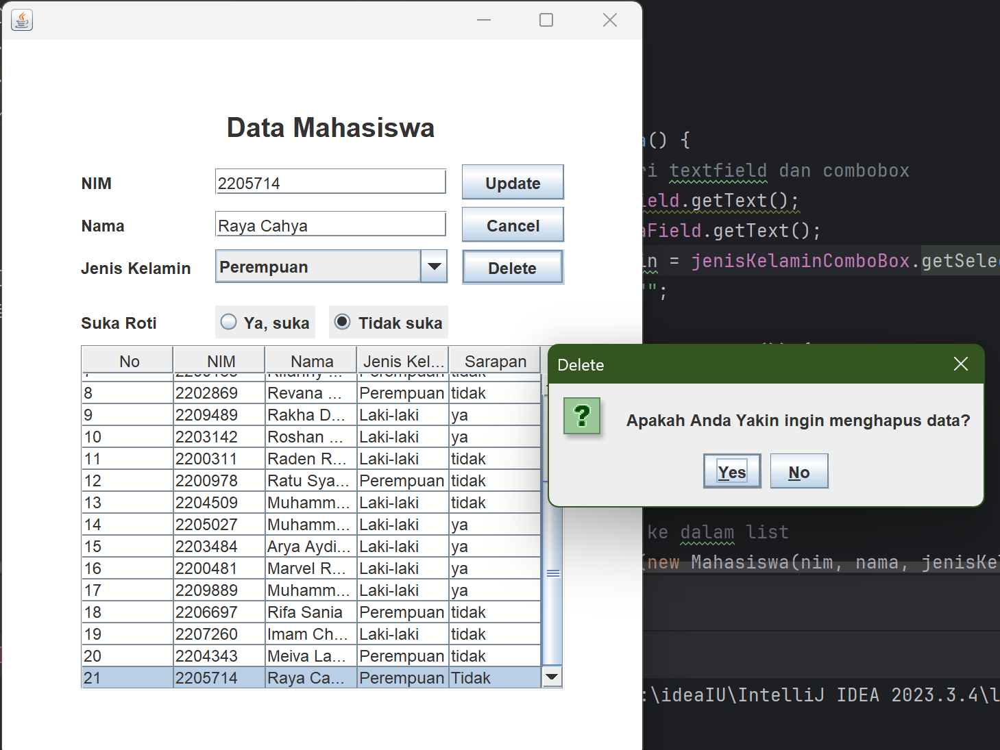
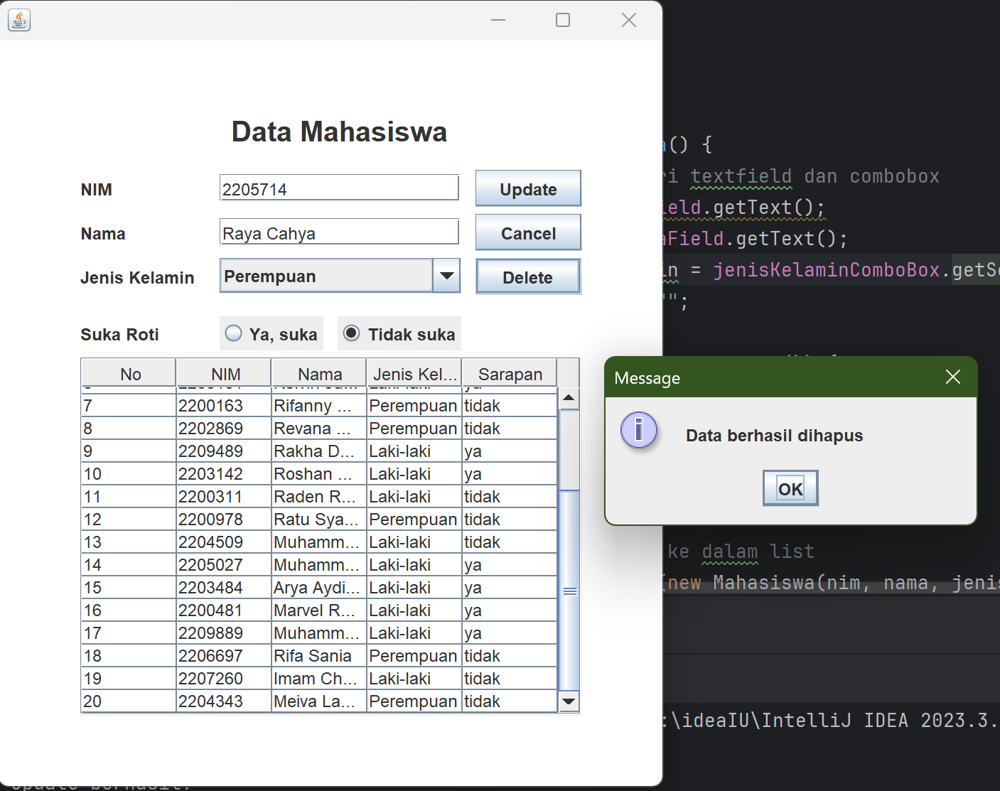
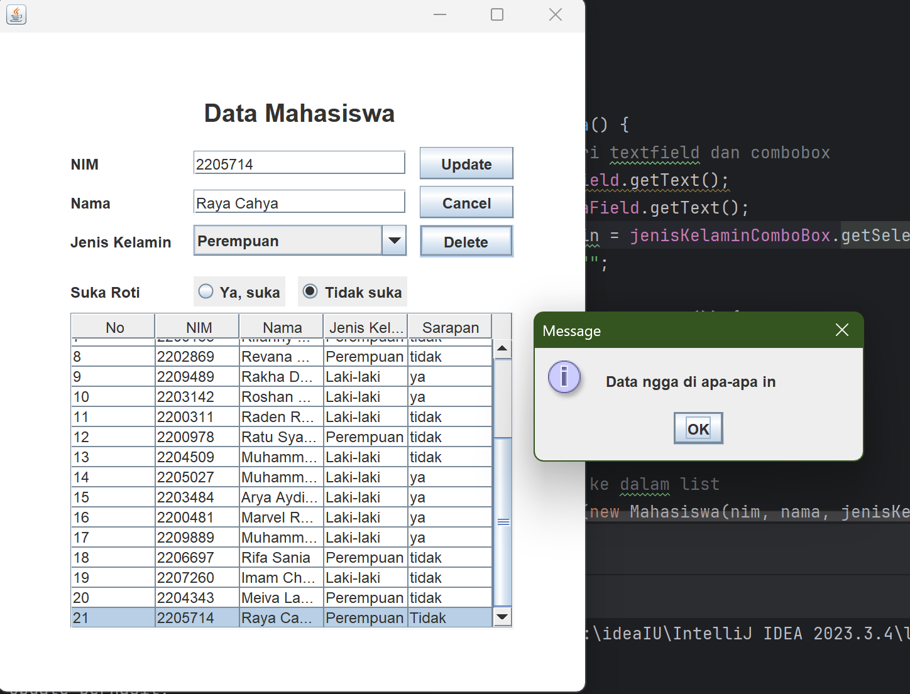

# Janji
Saya Raya Cahya Nurani NIM 2205714 mengerjakan soal Latihan Praktikum dalam mata kuliah Desain Pemograman Berorientasi Objek untuk keberkahanNya maka saya tidak melakukan kecurangan seperti yang telah dispesifikasikan. Aamiin.

## Desain Program
Dalam sebuah form memiliki 13 panel yaitu : 
* `JLabel` untuk titleLabel, nimLabel, namaLabel, jenisKelaminLabel, dan rotiField
* `JTextField` untuk nimfield, namafield
* `JButton` untuk addUpdateButton, deleteButton, cancelButton
* `JComboBox` untuk jenisKelaminComboBox
* `JRadioButton` untuk yaRadioButton dan tidak RadioButton

Dimana program akan menunjukkan list data mahasiswa yang sudah diberikan,

pada awalnya program akan menampilkan seperti ini : 

ketika ingin menambahkan data, isi form yang sudah disediakan lalu klik `add` maka program akan memunculkan seperti ini : 

lalu ketika ingin mengubah data maka klik pada data yang ingin diubah, nantinya data data akan terisi secara otomatis pada teks field, lalu ubah data dan klik tombol `update` disebelah kanan, dan akan memunculkan notifikasi seperti ini : 

ketika ingin menghapus data, klik pada data yang ingin dihapus lalu klik `delete` maka program akan memunculkan notifikasi seperti ini : 

jika data memang ingin di hapus maka klik `yes` dan program akan menghapus data 

jika data memang tidak ingin di hapus maka klik `no` dan program tidak akan menghapus data tersebut

